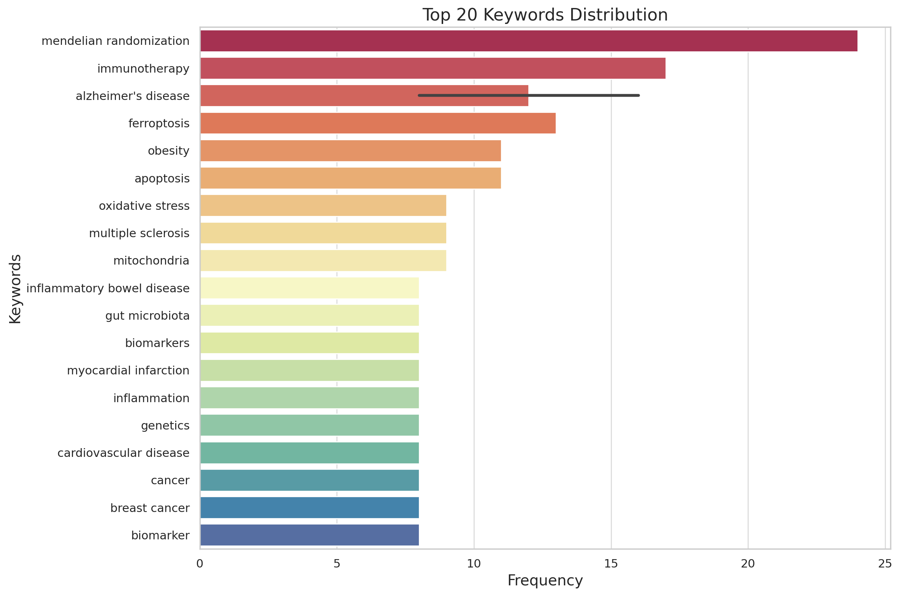
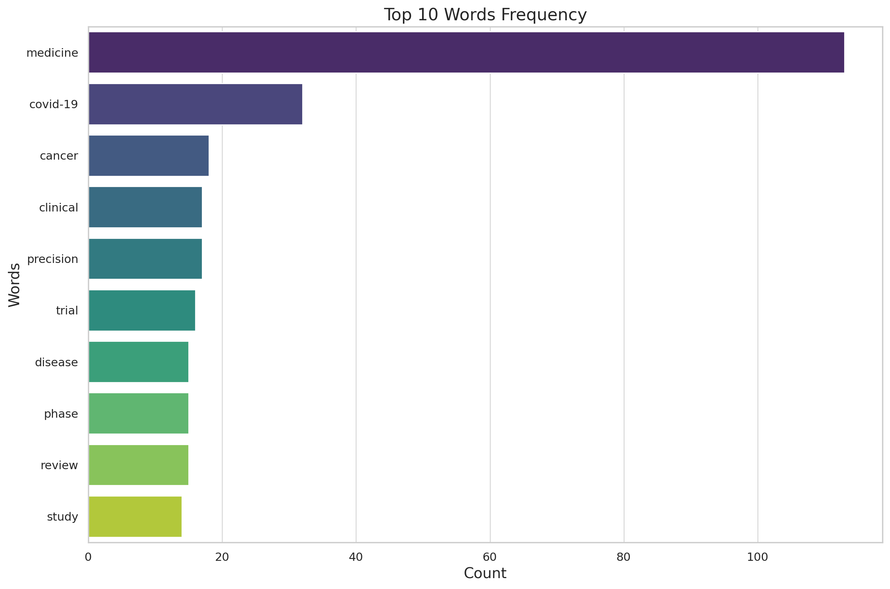
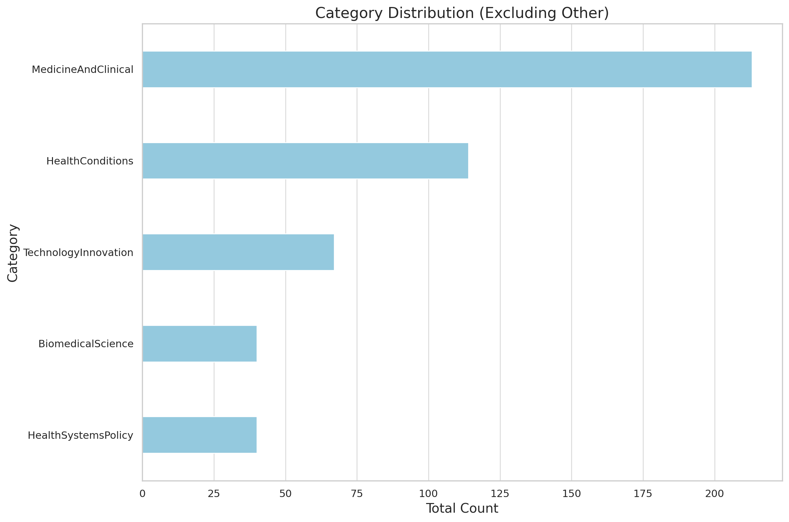

 ### Research Interest: 
***
In recent years, we have been surrounded by a variety of diseases and medical
challenges. With the rapid advancement of medical technology, identifying the current
hot trends in medicine can provide a clearer picture of the prevailing research interests.
This insight not only informs the public about key focus areas but also helps me
determine where my data analysis skills could be most effectively applied.

 ### Data Sources: 
 ***
- The first dataset is sourced from **PubMed** website: _https://pubmed.ncbi.nlm.nih.gov/_.
  
  Specifically, I choose to put the focus on the published “trend papers” from 2022 to
  2024. Overall there are 907 articles.
  
- The second dataset is sourced from **Google Scholar**. I type in the search keyword
  “medicine”, and specify the time range from 2022 to 2024, collecting information from
  200 web pages, with overall 2000 articles. The first web page can be accessed:
  _https://scholar.google.com/scholar?start=50&q=medicine&hl=en&as_sdt=0,34&as_ylo=
  2022&as_yhi=2024_.

 ### Results:
**A. From Pubmed**, Out of 907 articles, 853 contain keyword sections, here is the highly frequent keywords found.

 ### Figure 1: Top 20 Keywords Frequency

From the keyword, we can see that several key trends are prominent in recent medical research. 
First: **immunotherapy and cancer research**
The consistent mention of terms such as immunotherapy, tumor microenvironment, and various forms of cancer indicates a strong focus on developing and refining
immunotherapies. 
And also, with multiple terms related to Alzheimer’s disease, Parkinson’s
disease, and neurodegeneration, there is a clear underscore on these diseases’s **pathophysiology**.

Topics like myocardial infarction, heart failure, and hypertension highlights the
ongoing research into **cardiovascular health**, one of the leading causes of death worldwide. We
can also identify the research interest in **metabolic disorder** from terms like “type 2 diabetes,
insulin resistance.”, and with interest in genetic studies from terms “genetic testing, GWAS”. And
one big area of focus is **technology**. Terms such as “artificial intelligence, machine learning, and
data” appear a lot. 

**B. From Google Scholar**
2000 article titles have been scrapped. I remove some usual meaningless words, identify
them as “stop words” , remove them from the text dataframe, and analyze the
occurrence of each word. The frequencies of words are shown below. 

Since article titles contain more words and do not give as precise a description as keywords, I
define five categories in the medical field: medicine and clinical (it involves surgery, anesthesia,
medical treatment, therapies) ; health conditions (it refers to specific diseases: covid-19, cancer,
diabetes, infections, Alzheimer’s ) , technology and innovation (artificial intelligence, data),
biomedical science (biological processes and mechanism), health policy. And then based on the
similarity between words and each group, assign each word to the group. If the word is not
similar to any one of the groups, assign it to “other”. It turns out that there are many distracting
words in titles, and out of those meaningful words, medicine and clinical, health conditions, and
technology occupy the largest area, which aligns with our finding in the first data source.

 
